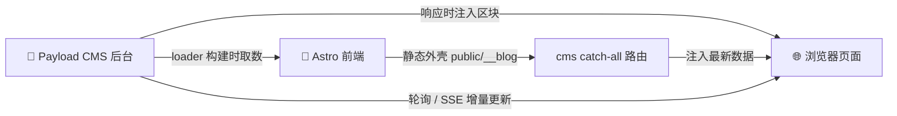

<div align="center">

# ☁️ cloud-blog · 云岫的博客

**一个「前台 + 后台」双应用的 Monorepo** — 用 Astro 🌠 做站点，用 Payload CMS 💼 管内容。


**✨ 一条命令搞定发布 ✨**

</div>

---

## 🧬 仓库速览

两个应用相互独立、各自带 `package.json` 与 lockfile；**部署时作为同一个 EdgeOne Makers 项目**（根目录 `apps/cms`）一起上线，前后台同域名：

| 📦 目录 | 🚀 应用 | 🧰 技术栈 | 💡 说明 |
| --- | --- | --- | --- |
| `apps/blog` | 博客前端 | 🌠 Astro 7（静态站） | 文章 / 随笔 / 归档 / 搜索 / RSS / 关于页，构建时从后台拉取内容 |
| `apps/cms` | 内容后台 | 💼 Payload CMS 3 + Next.js 15 | 文章 / 随笔 / 项目 / 分类标签 / 站点设置 / 导航管理，是内容的**唯一数据源** |

```
cloud/
├── 📦 apps/
│   ├── 🌠 blog/                    # → EdgeOne Makers 项目 1（站点）
│   │   ├── astro.config.mjs                    # Astro 配置（含 payload-hot-reload）
│   │   ├── src/                                # 页面 / 组件 / content collections / 样式
│   │   │   ├── content.config.ts               # posts / notes / projects 集合定义
│   │   │   └── lib/
│   │   │       ├── payload-api.ts              # 后台 REST 客户端（文章/随笔/项目/设置/导航）
│   │   │       ├── payload-loader.ts           # Astro loader：从后台载入并轮询变化
│   │   │       ├── site-defaults.ts            # 站点默认值（后台缺失时兜底）
│   │   │       ├── site-settings.ts            # 从后台读取站点设置
│   │   │       └── posts.ts                    # 站点信息与文章排序等工具
│   │   ├── public/                             # 静态资源
│   │   ├── patches/                            # astro 本地开发补丁（中文路径编码）
│   │   ├── package.json                        # 独立依赖 + lockfile
│   │   ├── .env.example                        # 站点环境变量示例
│   │   └── README.md                           # 博客使用说明
│   └── 💼 cms/                     # → EdgeOne Makers 项目 2（后台）
│       ├── src/payload.config.ts               # Payload 主配置
│       ├── src/collections/                    # Posts / Notes / Projects / Categories / Tags / Media / Users
│       ├── src/globals/                        # SiteSettings / Navigation
│       ├── src/lib/                            # blog-render（区块渲染）/ blog-sync（数据同步）/ sync-cache
│       ├── src/app/api/                        # blog-sync（版本探测+全量区块）/ blog-sync/stream（SSE）
│       ├── src/migrations/                     # Postgres 迁移（含 projects 集合）
│       ├── next.config.mjs
│       ├── scripts/                            # copy-blog-to-public / warmup 等
│       ├── package.json                        # 独立依赖 + lockfile
│       └── tsconfig.json
├── 📄 package.json                # 根编排脚本（私有，无第三方依赖）
├── 📌 .gitignore
└── 📜 LICENSE
```

---

## 🏗️ 内容架构

> [!IMPORTANT]
> 写博客的**所有内容都放进后台**，前台**不再维护本地 Markdown / JSON 数据**。

- 🗄️ **数据源**：`apps/cms` 的 Payload 集合是唯一事实来源 — 文章（Posts）、随笔（Notes）、项目（Projects）、分类（Categories）、标签（Tags），外加两个全局：站点设置（SiteSettings）与导航（Navigation）。
- 📡 **前台取数**：`apps/blog` 通过 Astro content loader（`payload-loader.ts`）在构建 / 开发时从后台 REST API 拉取 posts / notes / projects；站点名称、描述、作者在后台缺失时回退到 `lib/site-defaults.ts` 的默认值。
- 🧩 **关于页项目**：开源项目与资源下载卡片全部来自后台 `projects` 集合（按 `group` 分组聚合），不再依赖 GitHub API 构建时抓取或本地缓存 JSON。
- 🔥 **首屏就是最新数据**：`apps/cms` 的 catch-all 路由（`src/app/[[...path]]/route.ts`）在返回 HTML 前，会用 `blog-render` 按后台最新数据渲染区块并**直接注入静态外壳**，所以打开页面不会先闪一下构建时的旧内容。博客 HTML 单独放在 `apps/cms/public/__blog/`（不能摊在 `public/` 根下，否则会被静态托管直接命中、绕过注入）。
- 🔁 **页面打开后继续同步**：后台数据变更后，已打开的页面通过轮询（`/api/blog-sync?version=1` 版本探测 + 全量区块，SSE `/api/blog-sync/stream` 亦可）局部替换带 `data-sync-block` 锚点的区块。服务端已注入过的区块带 `data-sync-version`，版本一致时客户端不会重复改写 DOM。

> [!IMPORTANT]
> 区块约定：`blog-render` 里每个渲染函数返回的是**锚点元素的 innerHTML**（不含外层容器），
> 与 `*.astro` 模板中 `<xxx data-sync-block="id">` 一一对应。若返回里再带一层同名容器，
> 每次同步都会多套一层（双层边框/内边距）。



---

## 🚀 本地开发

> [!TIP]
> 前端会优先从后台取数；**同时启动两个应用**才能看到完整内容。

```bash
# 🛠️ 首次：分别安装两个应用的依赖
npm run setup

# 🖥️ 终端 1：博客前端 → http://localhost:4321
npm run dev:blog

# 🗄️ 终端 2：内容后台 → http://localhost:9527  （默认 SQLite，零配置）
npm run dev:cms
```

- 📡 前端构建/开发时从后台 API（`PUBLIC_PAYLOAD_URL`，默认 `http://localhost:9527`）拉取内容；**后台未运行时文章/随笔/项目为空**，但页面仍可正常访问（站点默认值兜底）。
- ⚡ 开发期后台数据变更会热同步到前台页面（`payload-hot-reload`：loader 检测变化后 touch 标记文件并广播整页刷新；生产走 SSE + 轮询）。各应用详情见 `apps/blog/README.md`、`apps/cms/package.json`。

---

## 🗝️ 环境变量

`apps/blog/.env`（参考 `apps/blog/.env.example`）：

| 🎛️ 变量 | 💡 用途 |
| --- | --- |
| `SITE_URL` | 站点正式域名（RSS / sitemap / canonical），构建时写入静态产物 |
| `PUBLIC_PAYLOAD_URL` | Payload 后台地址，本地默认 `http://localhost:9527`；线上填**真实域名**（不带 `/api`） |
| `PUBLIC_TWIKOO_ENV_ID` | Twikoo 评论后端，不配则评论隐藏 |
| `PUBLIC_NETEASE_PLAYLIST_ID` / `PUBLIC_MUSIC_API` | 🎵 音乐播放器歌单 |

> 前台取数地址的优先级：`PUBLIC_PAYLOAD_URL` → `SITE_URL`（一体化部署前后台同域）→ `http://localhost:9527`。

`apps/cms` 生产环境变量（本地 SQLite 无需配置）：

| 🎛️ 变量 | 💡 用途 |
| --- | --- |
| `DATABASE_DRIVER` | `sqlite`（默认）/ `postgres` |
| `POSTGRES_URL` | `postgres` 时的连接串（如 Neon） |
| `PAYLOAD_SECRET` | Payload 加密密钥（生产必填） |
| `PAYLOAD_FORCE_PUSH=1` | 首次向线上库非交互建表 |

---

## 🚢 部署到 EdgeOne Makers（一体化：前台 + 后台同一个项目）

前后台部署在**同一个 EdgeOne Makers 项目**里，同域名：`/` 是博客，`/admin`、`/api` 是 Payload 后台。

| 🧭 配置项 | 🔧 值 |
| --- | --- |
| 仓库根目录 | `apps/cms` |
| 框架预设 | `Next.js`（必须是这个，否则 catch-all 路由与 SSR 不生效） |
| 构建命令 | 见 `apps/cms/edgeone.json`（装 blog 依赖 → `astro build` → `next build` → 复制产物到 `public/`） |
| 输出目录 | `.next` |
| Node 版本 | 22.21.1 |

**环境变量要配在 cms 项目上：**

| 🎛️ 变量 | 💡 用途 |
| --- | --- |
| `DATABASE_DRIVER` | `postgres` |
| `POSTGRES_URL` | Supabase / Neon 连接串 |
| `PAYLOAD_SECRET` | Payload 加密密钥 |
| `NEXT_PUBLIC_SERVER_URL` | 站点正式域名（如 `https://blog.iceuu.icu`） |
| `SITE_URL` | 同上（Astro 构建用：canonical / RSS / sitemap） |
| `PUBLIC_PAYLOAD_URL` | **只要域名**（如 `https://blog.iceuu.icu`），不要带 `/api` |
| `PAYLOAD_FORCE_PUSH=1` | 仅首次建表用，建完请删掉 |

> [!WARNING]
> - `PUBLIC_PAYLOAD_URL` / `SITE_URL` 必须是**真实线上域名**。若留占位域名，Astro 构建时拉不到后台数据，
>   会退化成「模板默认文案 + 0 篇文章」，并且**不会生成任何文章详情页**（`/posts/*` 全部 404）。
>   构建日志里会打印明确的 `[payload-loader] ⚠️` 提示。
> - 首次部署（站点还没上线时）构建必然拉不到数据，属正常；上线后在控制台填好域名重新部署一次即可。
> - **Serverless 无持久磁盘，CMS 的 SQLite 单文件只适合本地开发；线上必须用 `postgres` 托管库**（项目已内置 `@payloadcms/db-postgres`，并带 `projects` 集合的迁移）。
> - CMS 依赖 Node 运行时与 `sharp`，请在 Makers 中选择支持 Node/Next SSR 的方案（而非纯边缘函数）。
> - **运行时常量**：SSE 与内存缓存均为单实例级；EdgeOne 多实例时靠 5s TTL 快照 + 前台轮询兜底，最终一致。
> - `apps/blog/patches/astro+7.2.0.patch` 为本地开发用补丁（修复中文路径 301 跳转的 Location 头编码），静态托管无需生效。

---

## 🧰 后台脚本说明

| 📜 脚本 | ✨ 作用 |
| --- | --- |
| `apps/cms/src/scripts/import-markdown.ts` | 把历史 `apps/blog/src/content` 的 Markdown 导入后台（`npm run import:data`），用于一次性数据迁移，日常维护均在后台完成 |
| `apps/cms/scripts/copy-blog-to-public.mjs` | 构建站点后把博客产物复制到 CMS public 目录（`npm run build:all` 时执行） |
| `apps/cms/scripts/generate-preview-css.mjs` | 读取 `apps/blog/src/styles/global.css` 生成后台 Markdown 预览样式 |
| `apps/cms/scripts/warmup.mjs` | 部署后预热后台接口 |

---

## 📜 许可证

**MIT** ✅ — 详见根目录 [LICENSE](LICENSE)。

---

<div align="center">

Made with ❤️ · 记录 AI、代码、网站搭建和技术观察

</div>
